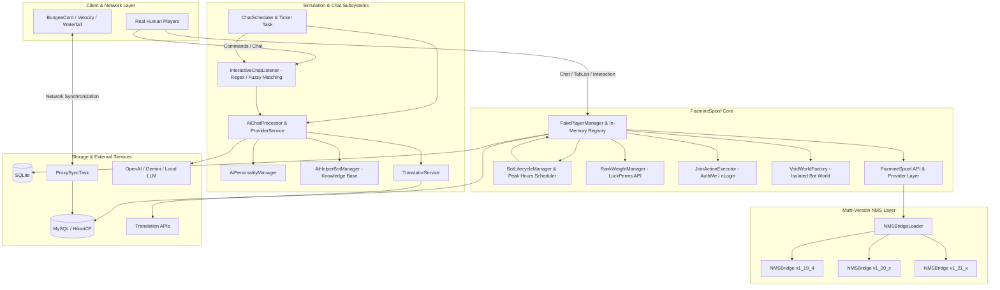
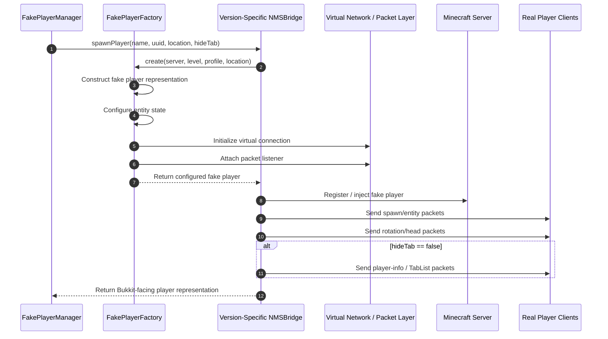
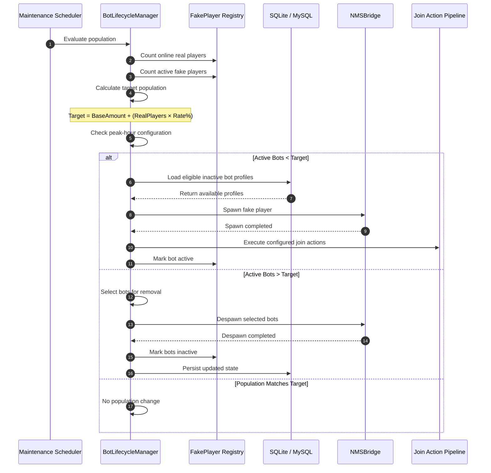
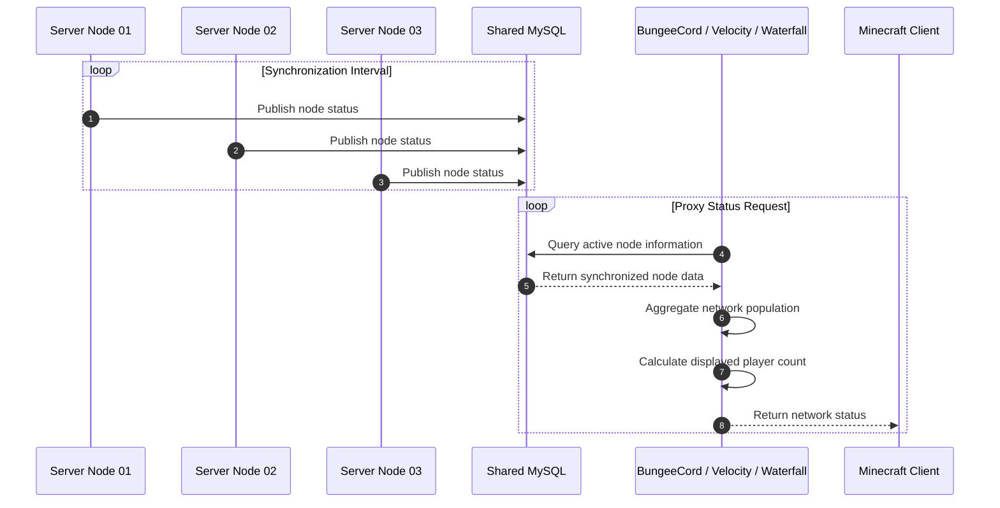

# 📊 System Architecture & Workflow Diagrams

This document describes the internal architecture, multi-version NMS abstraction layer, fake-player lifecycle, chat-processing pipeline, proxy synchronization, and performance design of **FozmineSpoof**.

The diagrams are written in Mermaid and can be rendered by documentation platforms that support Mermaid syntax.

---

## 📑 Table of Contents

1. [High-Level Subsystem Architecture](#1-high-level-subsystem-architecture)
2. [Multi-Version NMS Entity & Packet Pipeline](#2-multi-version-nms-entity--packet-pipeline)
3. [Bot Lifecycle & Dynamic Population Balancing](#3-bot-lifecycle--dynamic-population-balancing)
4. [Intelligent Chat & AI Processing Flowchart](#4-intelligent-chat--ai-processing-flowchart)
5. [Multi-Server Proxy Synchronization Matrix](#5-multi-server-proxy-synchronization-matrix)
6. [Key Architectural Highlights & Performance Design](#6-key-architectural-highlights--performance-design)

---

# 1. High-Level Subsystem Architecture

The following architecture illustrates how real players, proxy infrastructure, core managers, simulation systems, NMS implementations, databases, and external AI services interact.



## Architecture Responsibilities

| Component                 | Responsibility                                                           |
| ------------------------- | ------------------------------------------------------------------------ |
| `FakePlayerManager`       | Maintains active fake-player instances and metadata.                     |
| `BotLifecycleManager`     | Controls spawning, despawning, population targets, and lifecycle timing. |
| `NMSBridgeLoader`         | Selects the correct version-specific NMS implementation.                 |
| `NMSBridge`               | Provides version-specific entity and packet operations.                  |
| `RankWeightManager`       | Assigns weighted LuckPerms groups.                                       |
| `JoinActionExecutor`      | Handles configured join-time commands.                                   |
| `VoidWorldFactory`        | Provides an isolated environment for simulated entities.                 |
| `ChatScheduler`           | Controls automated chat processing.                                      |
| `InteractiveChatListener` | Detects configured triggers and player interactions.                     |
| `AiChatProcessor`         | Builds and dispatches AI conversations.                                  |
| `AiPersonalityManager`    | Provides personality and speaking-style context.                         |
| `AiHelperBotManager`      | Handles the dedicated support-bot knowledge base.                        |
| `TranslatorService`       | Provides optional translation processing.                                |
| `ProxySyncTask`           | Synchronizes fake-player state between server nodes.                     |

---

# 2. Multi-Version NMS Entity & Packet Pipeline

FozmineSpoof isolates Minecraft-version-specific implementation behind an NMS abstraction layer.

This allows the core system to remain largely independent from individual Minecraft server versions.

The exact NMS classes and packet names may differ between supported versions.



## NMS Abstraction

The architecture separates version-independent logic from version-specific implementation.

```text
Core
 │
 ▼
NMSBridge
 │
 ├── NMSBridge_v1_19_4
 ├── NMSBridge_v1_20_x
 └── NMSBridge_v1_21_x
```

The core managers should interact with the bridge interface rather than directly depending on version-specific NMS classes whenever possible.

### Benefits

* Easier Minecraft-version upgrades
* Reduced code duplication
* Cleaner core modules
* Easier maintenance
* Safer version-specific changes
* Better separation of responsibilities

---

# 3. Bot Lifecycle & Dynamic Population Balancing

The lifecycle manager periodically evaluates the current server population and determines whether fake players should be added or removed.

A typical maintenance cycle can run asynchronously or through a lightweight scheduled task, while actual Minecraft entity operations are performed on the appropriate server thread.



## Population Calculation

The target population can be represented as:

$$
T =
B +
\left(
R \times \frac{P}{100}
\right)
$$

Where:

* `T` = target fake-player population
* `B` = configured base amount
* `R` = number of real players
* `P` = configured percentage rate

Example:

```text
Base amount = 10
Real players = 50
Rate = 10%
```

```text
Target = 10 + (50 × 0.10)
Target = 15 fake players
```

## Peak-Hour Override

When a configured peak-hour period is active, the lifecycle manager can use the fluctuation settings instead of the normal population baseline.

```text
Normal Hours
     │
     ▼
Calculate Normal Target
     │
     ▼
Peak Schedule Check
     │
 ┌───┴────┐
 │        │
No       Yes
 │        │
 ▼        ▼
Normal   Peak Target
Target   Calculation
 │        │
 └───┬────┘
     ▼
Population Reconciliation
```

---

# 4. Intelligent Chat & AI Processing Flowchart

The chat system routes messages according to the configured chat mode and message intent.

AI requests are validated before being dispatched to an external provider.

```mermaid
flowchart TD
    A[Incoming Player Message] --> B{Chat System Mode?}

    B -->|AI| C{Message Intent?}
    B -->|Normal| O{Matches Configured Trigger?}

    C -->|@FozmineBot| D[AI Support Desk]
    C -->|@Bot / Bot Name| E[Player-to-AI]
    C -->|Private Message| F[Private Message Handler]
    C -->|No AI Intent| Q[Normal Chat Processing]

    D --> G[Load Server Knowledge Base]
    E --> H[Load Bot Personality]
    F --> H

    G --> I[Build AI Context]
    H --> I

    I --> J[Validate Input]
    J --> K{Rate Limit / Security Check}

    K -->|Blocked| L[Send Warning / Reject Request]
    K -->|Allowed| M[Build Provider Request]

    M --> N[Async AI Provider Request]

    N --> N1[OpenAI]
    N --> N2[Gemini]
    N --> N3[Local LLM]

    N1 --> P[AI Response]
    N2 --> P
    N3 --> P

    P --> R[Output Sanitization]
    R --> S[Apply Speaking Style]
    S --> T[Calculate Typing Delay]
    T --> U[Format Message]
    U --> V[Broadcast Response]

    O -->|Yes| W[Interactive Chat Handler]
    O -->|No| Q

    W --> X[Check Cooldowns]
    X --> Y[Optional Translation]
    Y --> V

    Q --> Z[Ambient Chat Scheduler]
    Z --> AA[Select Random Message]
    AA --> V
```

## AI Request Pipeline

The AI processing pipeline follows this general sequence:

```text
Player Message
      │
      ▼
Intent Detection
      │
      ▼
Security Validation
      │
      ├── Blocked ──► Reject
      │
      ▼
Context Construction
      │
      ├── Personality
      ├── Language
      ├── Knowledge Base
      └── Conversation Memory
      │
      ▼
Async Provider Request
      │
      ▼
AI Response
      │
      ▼
Sanitization
      │
      ▼
Speaking Style
      │
      ▼
Typing Delay
      │
      ▼
Minecraft Chat
```

---

# 5. Multi-Server Proxy Synchronization Matrix

For multi-server networks, individual FozmineSpoof nodes can synchronize their fake-player state through shared infrastructure.

A shared MySQL database can be used as the persistence and coordination layer.



## Example Synchronization Data

A node can publish information conceptually similar to:

```text
node = survival-01
active-bots = 12
inactive-bots = 38
timestamp = ...
```

Another node could publish:

```text
node = skyblock-01
active-bots = 25
inactive-bots = 75
timestamp = ...
```

The proxy layer can then aggregate the relevant values.

```text
Network Population
        │
        ├── Survival
        │     └── 12 bots
        │
        ├── SkyBlock
        │     └── 25 bots
        │
        └── Other Nodes
              └── ...
```

> **Implementation Note:** The proxy itself does not necessarily need direct database access. A dedicated proxy-side bridge/plugin can perform synchronization while the backend FozmineSpoof instances publish their state through the configured transport layer.

---

# 6. Key Architectural Highlights & Performance Design

## 6.1 Isolated Bot World

The configured `botworld` can be used to isolate fake-player entities from normal gameplay worlds.

Conceptually:

```text
Normal Gameplay Worlds
        │
        │
        ├── Survival
        ├── SkyBlock
        └── Other Worlds

             X

        Bot Environment
             │
             ▼
          botworld
```

This reduces unnecessary interaction between simulated entities and active gameplay environments.

Potential benefits include:

* Reduced entity interaction
* Reduced mob targeting
* Reduced gameplay interference
* Easier lifecycle management
* Cleaner fake-player isolation

> The actual performance benefit depends on how the fake-player entities and world are implemented.

---

## 6.2 Non-Ticking / Reduced-Ticking Entity Design

The fake-player implementation can minimize unnecessary server-side entity processing.

The implementation should avoid expensive operations such as:

* Pathfinding
* Physics
* AI targeting
* Unnecessary collision processing
* Repeated world interactions

Conceptually:

```text
Normal Server Player
        │
        ├── Movement
        ├── Physics
        ├── Interaction
        ├── AI-related processing
        └── Other server logic

Fake Player
        │
        ├── Required entity state
        ├── Packet visibility
        ├── TabList state
        └── Minimal lifecycle processing
```

This architecture is intended to reduce the cost of maintaining large numbers of simulated players.

---

## 6.3 Concurrent In-Memory Registry

Frequently accessed fake-player metadata should remain in memory.

A concurrent registry can provide fast access to:

* UUID → fake-player data
* Name → fake-player data
* Online status
* World/location information
* Personality information
* Session state

Example conceptual structure:

```text
ConcurrentHashMap

UUID
 │
 ├── Name
 ├── Status
 ├── Location
 ├── Personality
 ├── Session
 └── Metadata
```

Read-heavy operations such as:

* Listing bots
* Checking online status
* Tab completion
* Looking up player metadata

can therefore avoid unnecessary database reads.

> `O(1)` represents expected average hash-map lookup complexity; it does not mean that every operation in the overall system is literally constant-time.

---

## 6.4 Asynchronous Database Processing

Database operations should be separated from latency-sensitive Minecraft operations.

Recommended architecture:

```text
Minecraft Main Thread
        │
        ├── Entity Operations
        ├── Packet Operations
        └── Bukkit API Operations
                │
                ▼
        Async Task / CompletableFuture
                │
        ├── SQLite
        └── MySQL
```

This prevents slow database operations from unnecessarily blocking the server thread.

### SQLite

SQLite can be configured for standalone installations.

Recommended considerations include:

* WAL mode
* Connection management
* Batched writes
* Controlled transaction sizes
* Async persistence

### MySQL

MySQL is more appropriate for multi-server environments.

A connection pool such as HikariCP can be used to efficiently manage database connections.

---

## 6.5 Asynchronous AI Requests

External AI requests should never block the Minecraft main thread.

Recommended flow:

```text
Minecraft Main Thread
        │
        ▼
Receive Chat Event
        │
        ▼
Validate Message
        │
        ▼
Schedule Async AI Task
        │
        ▼
HTTP Request
        │
        ▼
AI Provider
        │
        ▼
Response Processing
        │
        ▼
Schedule Minecraft-Safe Task
        │
        ▼
Broadcast Chat
```

This architecture isolates unpredictable network latency from the server tick loop.

---

## 6.6 Performance Design Principles

FozmineSpoof should follow these principles when scaling to larger networks:

### Keep the Main Thread Lightweight

Avoid:

* Blocking HTTP requests
* Blocking database queries
* Large synchronous loops
* Expensive entity searches
* Repeated disk access

### Cache Frequently Used Data

Keep frequently accessed information in memory where practical.

### Batch Persistence

Avoid writing to the database for every minor state change.

### Limit AI Requests

Use:

* Rate limits
* Cooldowns
* Minimum real-player thresholds
* Short response lengths
* Conversation expiration

### Separate Responsibilities

Keep the architecture modular:

```text
Core
 │
 ├── Lifecycle
 ├── Registry
 ├── Persistence
 ├── NMS
 ├── Chat
 ├── AI
 ├── Translation
 ├── Proxy
 └── Configuration
```

This makes individual components easier to test, replace, and maintain.

---

# 📌 Architectural Summary

| Layer             | Primary Responsibility                                   |
| ----------------- | -------------------------------------------------------- |
| Client Layer      | Real-player interaction and visual presentation.         |
| Proxy Layer       | Network-level server synchronization.                    |
| Core Layer        | Lifecycle, registry, configuration, and orchestration.   |
| NMS Layer         | Minecraft-version-specific entity and packet operations. |
| Chat Layer        | Interactive, ambient, and AI-assisted conversations.     |
| AI Layer          | LLM communication, personalities, memory, and support.   |
| Translation Layer | Optional multilingual processing.                        |
| Persistence Layer | SQLite/MySQL storage and synchronization.                |
| Security Layer    | Rate limiting, input validation, and output filtering.   |

---

# 🔄 Complete System Flow

```text
                    ┌──────────────────────┐
                    │   Minecraft Client   │
                    └──────────┬───────────┘
                               │
                               ▼
                    ┌──────────────────────┐
                    │  FozmineSpoof Core   │
                    └──────────┬───────────┘
                               │
              ┌────────────────┼────────────────┐
              │                │                │
              ▼                ▼                ▼
       ┌────────────┐   ┌────────────┐   ┌────────────┐
       │  Lifecycle │   │    Chat    │   │    Proxy   │
       │   Manager  │   │   Engine   │   │    Sync    │
       └─────┬──────┘   └──────┬─────┘   └─────┬──────┘
             │                 │               │
             ▼                 ▼               ▼
       ┌────────────┐   ┌────────────┐   ┌────────────┐
       │ NMS Bridge │   │ AI / Regex │   │   MySQL    │
       │  Layer     │   │  / Fuzzy   │   │    DB      │
       └─────┬──────┘   └──────┬─────┘   └────────────┘
             │                 │
             ▼                 ▼
       ┌────────────┐   ┌────────────┐
       │ Fake Player│   │ LLM /      │
       │  Entities  │   │ Translator │
       └────────────┘   └────────────┘
```

---

# ✅ Final Architecture Principles

FozmineSpoof is designed around six core principles:

1. **Version Isolation** — Keep NMS-specific code separated from the core engine.
2. **Thread Safety** — Keep blocking database and HTTP operations away from the Minecraft main thread.
3. **Modularity** — Separate lifecycle, persistence, NMS, chat, AI, and proxy responsibilities.
4. **Efficient State Management** — Cache frequently accessed player information in memory.
5. **Controlled Automation** — Use cooldowns, rate limits, and population limits to prevent unnecessary processing.
6. **Scalable Infrastructure** — Support standalone SQLite deployments as well as multi-server MySQL-backed networks.

This architecture provides a maintainable foundation for expanding FozmineSpoof across multiple Minecraft versions, server nodes, chat providers, and AI backends.
